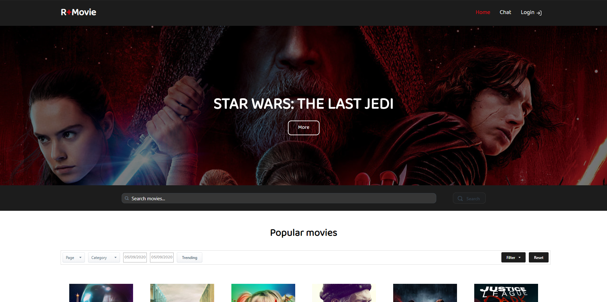
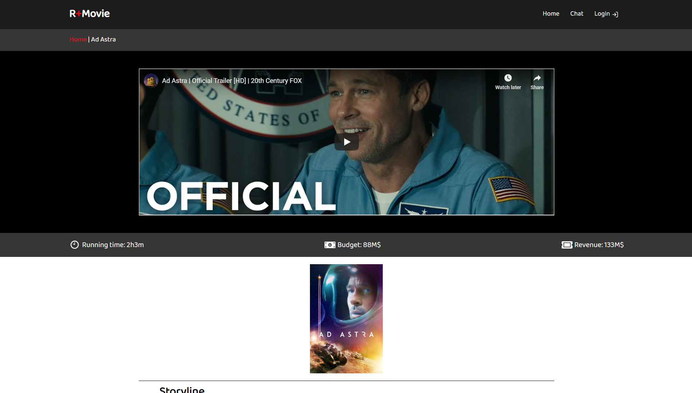
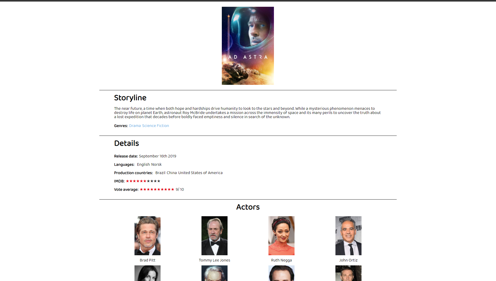
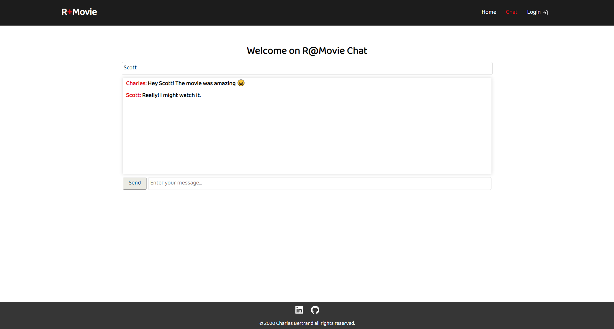

# R+Movie

R+Movie is an application where users can review, comment and search movies. They can search a movie with a search bar or with a filter. Also, a simple chat system was implemented to chat with other users about movies.

## GOALS

- Implement all the features to get my MVP.
- Make a beautiful UI design.
- Stretch goal: add a chat system with https://socket.io/

### Version 2

- Migrate chat sytem on mongoDB.
- Improve the speed of the chat.

## TECH STACK

- React
- NodeJS and express
- MongoDB

## RUN LOCALLY
```
$ git clone https://github.com/Charles9869/R-Movie.git
```
```
$ cd server
$ yarn install 
$ yarn start
```
```
$ cd client
$ yarn install
$ yarn start
```
## SCREENSHOTS

### Homagepage



### Movie page



### Actors page



### Chat page


